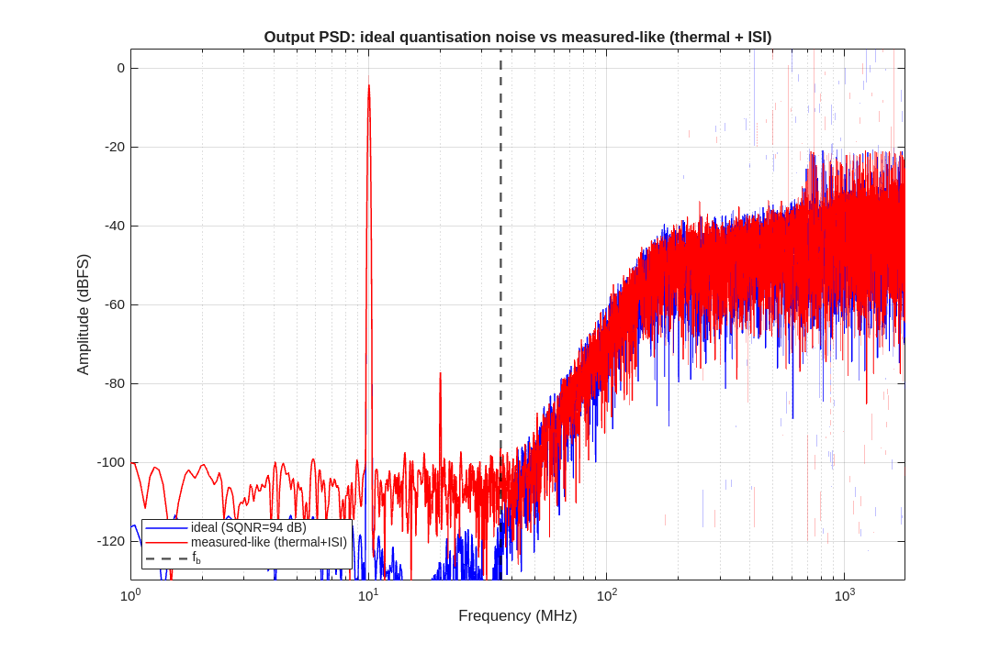

# ET4278 Oversampled Data Converters

Delta-sigma (ΔΣ) data-converter coursework at TU Delft, done with Jiahui (6551998). Everything is behavioral MATLAB modeling: build a modulator, run it, take the FFT, measure SNR/SNDR, and study how non-idealities degrade the noise-shaped spectrum. The work spans five graded assignments, three guided practicals, and a final oral-exam project that reproduces a published JSSC modulator from scratch.

## Assignments

`assignment1/` to `assignment5/`, each a single MATLAB script with a results folder and a verification script:

- Quantizer and modulator basics, time and frequency domain (A1).
- SNR versus input amplitude for different modulator orders, with spectra (A2).
- MASH / cascaded modulators (A3).
- FIR feedback DACs: FIR outside and inside the loop, excess-loop-delay compensation, and maximum stable amplitude (A4).
- Two-stage / cascaded noise transfer, gain error, thermal noise, and integrator slewing (A5).

## Practicals

- `practical1/` MOD1: first-order modulator, leakage, offset, DC-input tones, decimation filtering.
- `practical2/` MOD2: second-order modulator in discrete and continuous time, feedback vs feed-forward topologies, NRZ DAC, coefficient scaling, local feedback, node-noise analysis.
- `practical3/` MASH and multi-bit: MASH cascade leakage, 3-bit thermometer DAC with mismatch and DWA/DEM, bandpass modulator.

Each practical folder has an `ANSWERS.md` and a full results gallery.

## Final oral exam project

`practical-exam/` is a complete study of Shettigar and Pavan, "Design Techniques for Wideband Single-Bit Continuous-Time ΔΣ Modulators With FIR Feedback DACs" (JSSC 2012): a 4th-order single-bit CT ΔΣ at 3.6 GS/s with an 8-tap semi-digital FIR feedback DAC.

The project includes a written paper analysis (`01_paper_analysis.md`), every paper figure extracted for study (`figures/`), the cited literature (`refs/`), and a from-scratch MATLAB reimplementation (`matlab/FIRDSM_*.m`) that reproduces the modulator and sweeps its non-idealities: clock jitter, integrator nonlinearity, comparator metastability, excess loop delay, DAC mismatch and ISI (with correction), and thermal-noise-limited decimation. `matlab/run_all.m` regenerates the full results set, and the oral presentation is built programmatically (`build_pptx.py`).

## Repository layout

| Path | Contents |
| --- | --- |
| `assignment1/` to `assignment5/` | Graded MATLAB assignments with results and verification |
| `practical1/` to `practical3/` | MOD1, MOD2, MASH practicals with answers and figures |
| `practical-exam/` | JSSC paper analysis, FIRDSM reimplementation, slides, references |

All modeling is plain MATLAB. Delta-sigma toolbox conventions are used where helpful, but the modulator loops are implemented directly.
