# Paper Analysis — Shettigar & Pavan, JSSC 2012

**"Design Techniques for Wideband Single-Bit Continuous-Time ΔΣ Modulators With FIR Feedback DACs"**
Pradeep Shettigar and Shanthi Pavan, *IEEE Journal of Solid-State Circuits*, vol. 47, no. 12, pp. 2865–2879, Dec. 2012.
DOI: 10.1109/JSSC.2012.2217871 · IIT Madras.

> This is the single source-of-truth description of the paper for the ET4278 final oral exam. Every figure has been extracted as an individual image under `figures/` so it can be reproduced and analysed on its own. Math is written in Unicode per the repo rules (no LaTeX).

---

## 0. Headline result (memorise these numbers)

| Quantity | Value |
|---|---|
| Architecture | 4th-order, **single-bit** CT ΔΣ, modified CIFB + input feed-forward |
| Feedback | **8-tap semi-digital FIR DAC** (NRZ) + analog FIR-delay compensation path |
| Sampling rate fs | **3.6 GS/s** |
| Signal bandwidth | 36 MHz (also reported for 25 MHz) |
| OSR | **50** (fs / 2 / 36 MHz ≈ 50) |
| NTF order / OBG | 4 / **1.5** (Lee's rule for a 1-bit loop) |
| Peak SNR / SNDR / DR (36 MHz) | 76.4 / 70.9 / 83 dB |
| Peak SNR / SNDR / DR (25 MHz) | 80.2 / 73.3 / 86 dB |
| Peak SNDR after ISI correction | **74.3 dB** (peak SNR 77.5 dB) |
| Power / supply | 15 mW (12.5 mA) from 1.2 V |
| Technology / area | 90 nm CMOS / 0.12 mm² |
| FoM_Walden (SNDR, 36 MHz) | 72.7 fJ/lvl |
| FoM_Schreier (36 MHz) | 176.8 dB |

`★` The companion ISSCC paper is ref [12] (Shettigar & Pavan, ISSCC 2012). Shettigar's own MS thesis (which would tabulate the omitted coefficients) is **not public** — derive them instead; the method is in `09_reference_notes.md` §B (mined from Sukumaran 2014 + Su-Wooley, both in `refs/`).

---

## 1. The problem the paper attacks (exam Q1 — "issues addressed")

A wideband CT ΔΣ designer must choose the quantizer resolution. The paper frames it as a **single-bit vs multi-bit trade-off**:

**Multi-bit quantizer — pros / cons**
- + Quantizer gain ≈ 1 → an aggressive NTF can be used → smaller OSR for a target SQNR → relaxed circuit speed.
- + Small feedback step size → **low clock-jitter sensitivity** (NRZ) and **relaxed loop-filter linearity** (loop filter processes small shaped noise).
- − Power-/area-hungry quantizer: comparators grow with levels, *and* the tolerable comparator offset shrinks → larger comparators / offset-correction; ADC input capacitance ↑ → quantizer delay ↑, clock-distribution power ↑. Power/area grow roughly **exponentially** with bits, so designs cap at ~4 bits.
- − Feedback **DAC mismatch** → needs DEM, which adds delay (unacceptable at GS/s) or calibration (complex logic).
- Key quantitative argument: going 8→16 levels in a 4th-order modulator only cuts the required fs by ~25 % for 95 dB SQNR — the sampling-rate saving does **not** offset the extra comparators. Turned around: drop to **1 bit**, recover SQNR by raising fs (×3 here) → lower power.

**Single-bit quantizer — pros / cons**
- + Trivial ADC + clock generator, low quantizer power, and an **inherently linear** 2-level DAC ⇒ **no DEM/calibration** ⇒ lower excess loop delay ⇒ higher fs possible.
- − **Data-dependent jitter from comparator metastability** perturbs the NRZ feedback pulse width → in-band SNR collapses (this is *the* dominant wideband single-bit problem, per Cherry–Snelgrove [7]).
- − Full-scale feedback transitions every cycle ⇒ worst-case clock-jitter sensitivity *and* a large signal into the loop filter ⇒ high loop-filter linearity/power.
- − Lee's rule limits OBG to ≈ 1.5 for stability ⇒ limited max SNR for a given OSR.

**Issues, listed for the slide:**
1. Clock-jitter sensitivity of single-bit NRZ feedback.
2. Data-dependent jitter from **comparator metastability**.
3. Loop-filter **linearity** demand of full-scale single-bit feedback.
4. Multi-bit's quantizer power/area + **DAC mismatch/DEM** overhead.
5. The FIR DAC introduces **excess loop delay** (group delay) that destabilises the loop — a problem the paper itself creates and must solve.

---

## 2. The techniques used (exam Q1 — "main techniques")

| # | Technique | What it fixes | Figure |
|---|---|---|---|
| T1 | **1-bit ADC + N-tap FIR feedback DAC** (semi-digital) | Gives multi-bit-like small-step feedback → low jitter + relaxed loop-filter linearity, while DAC stays 2-level-linear (no DEM) | Fig 1 |
| T2 | **First FIR tap set to zero** (= explicit 1-cycle delay) | Removes the metastability-sensitive tap; the later flip-flops see large inputs → fast regeneration | Fig 4 |
| T3 | **Analog FIR-delay compensation path** (E(z) FIR DAC₃ → bandpass H₁(s)) added in parallel to the I₄·I₃ path | Restores the target NTF after the FIR group delay; bandpass shape keeps the path's *own* jitter/offset out of band | Figs 5–9, 11 |
| T4 | **ELD compensation via an RZ DAC (DAC₀)** into the first integrator's input | Compensates comparator+DAC latency without a power-hungry summing amp around the quantizer | Figs 5, 7, 10 |
| T5 | **Modified CIFB + input feed-forward**, active-RC integrators, **assisted-opamp** technique [15] | Decouples the fast quantizer path from the precise path; small integrating caps; saves opamp power | Figs 5, 7, 10, 12 |
| T6 | **Switched-resistor feedback DACs** (reference-side vs virtual-ground-side switching) | Low-noise DACs without current-steering distortion; trade speed vs linearity | Fig 16 |
| T7 | **High-gain fast comparator latch** (large initial regeneration current) | Beats CML latch power for a given speed at 3.6 GS/s; mitigates metastability | Figs 13–15 |
| T8 | **On-chip LC-PLL** low-jitter clock | Supplies the GS/s clock; jitter is the limiter | Fig 18 |
| T9 | **Post-facto digital ISI correction** (add α at every rising edge) | Removes 2nd-harmonic + noise-floor rise from differential-DAC rise/fall asymmetry | Figs 17, 28–30 |

---

## 3. Architecture walk-through

### 3.1 FIR feedback DAC (Fig 1)
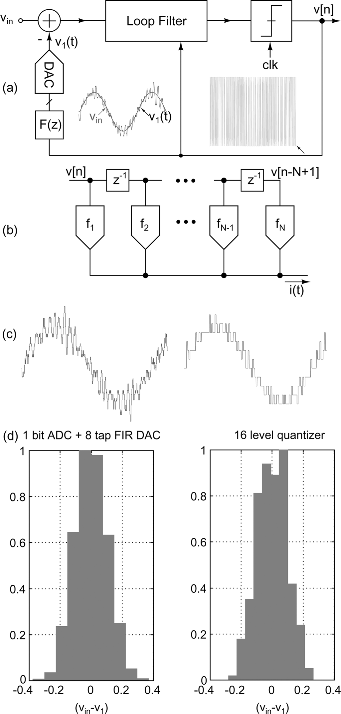

- **(a)** Single-bit CTDSM: loop filter → 1-bit quantizer (clocked) → output v[n]; the bitstream is filtered by **F(z)** and fed to the DAC, producing a smooth multi-level v₁(t) that tracks vin. Inset waveform shows v₁(t) hugging vin.
- **(b)** Semi-digital FIR DAC: a tapped delay line (z⁻¹) drives unit-element DAC currents weighted by f₁…f_N and summed as current i(t). **Tap (resistor) mismatch only perturbs the FIR coefficients — it does NOT create DAC non-linearity.** This is why the DAC stays linear with no DEM.
- **(c)** Feedback waveforms: 1-bit + 8-tap FIR DAC (left) vs 16-level quantizer (right) — both are multi-level staircases of similar smoothness.
- **(d)** Histograms of the shaped error (vin − v₁) processed by the loop filter for the two cases — nearly identical, i.e. the loop filter sees the same RMS swing ⇒ same jitter and linearity demands.

### 3.2 Why the first tap is zeroed (Fig 4 — metastability)
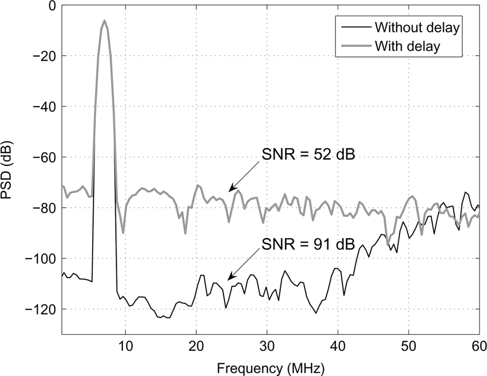
The first flip-flop tap is most exposed to comparator metastability. Setting f₁ = 0 (an explicit one-clock delay) lets subsequent flip-flops re-time a large signal → exponentially shorter regeneration → metastability noise removed. **Without delay: in-band SNR ≈ 52 dB; with delay: ≈ 91 dB** — a ~40 dB recovery in 36 MHz BW. *(Reproducible in MATLAB by adding a small data-dependent delay to the first tap only.)*

### 3.3 Jitter and nonlinear-integrator comparisons (Figs 2, 3)
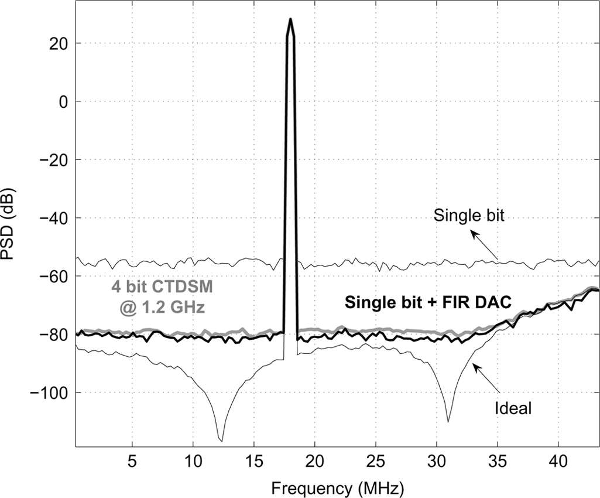
**Fig 2:** With 0.3 ps rms white jitter, the 1-bit+FIR-DAC modulator's jitter noise is **marginally lower than the 4-bit modulator** and far below the plain single-bit modulator. Four curves: *Ideal*, *Single bit* (high floor ≈ −55 dB), *4-bit CTDSM @1.2 GHz*, *Single bit + FIR DAC @3.6 GHz*.

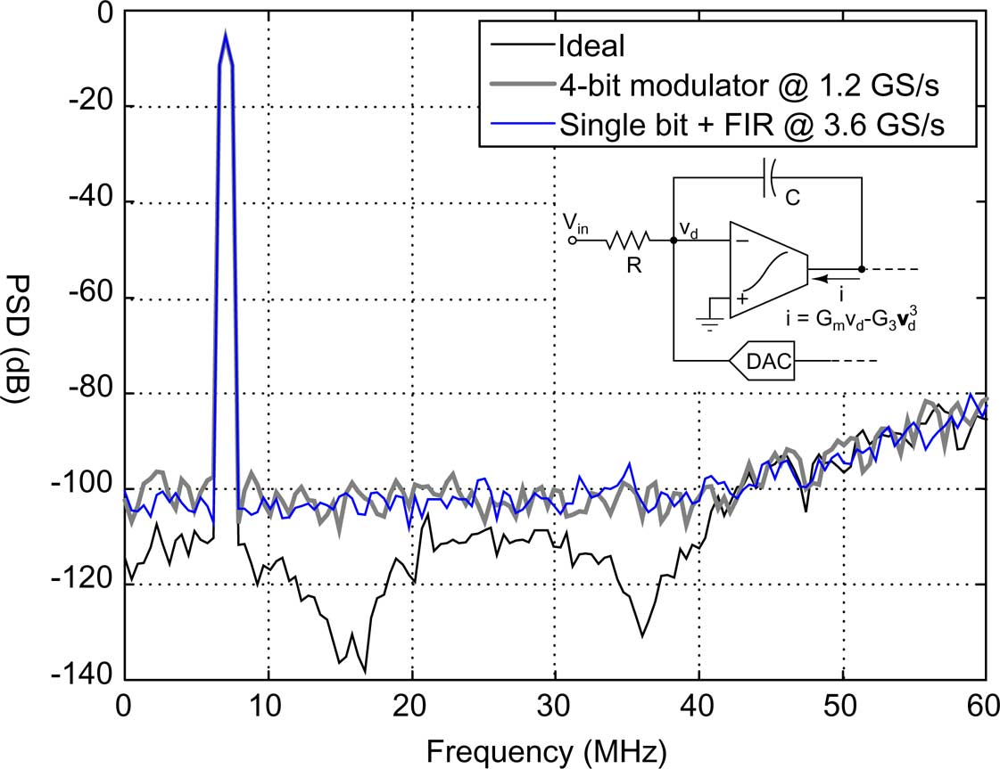
**Fig 3:** Input integrator made weakly nonlinear with output current i = G_m·v_d − G₃·v_d³ (inset), with G_m/G₃ = 1k, "20, 20". The 1-bit+FIR (3.6 GS/s) and 4-bit (1.2 GS/s) curves rise above *Ideal* by the **same** amount → both need comparable loop-filter linearity. *(Model with the weak-nonlinearity method of Pavan [14].)*

### 3.4 The starting point: modified CIFB (Fig 5)
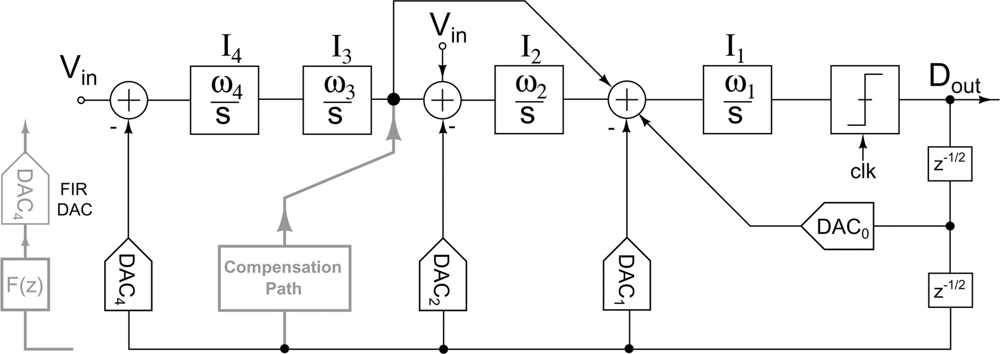
Four integrators I₄→I₃→I₂→I₁ (ω₄/s … ω₁/s), 1-bit quantizer with **z⁻¹ᐟ² half-delays**. CIFB is chosen because the fast path (ADC→DAC₀→I₁) is decoupled from the precise path (ADC→FIR→I₄→…), so each can be optimised independently. Feedback DACs DAC₄ (with F(z)), DAC₂, DAC₁ are driven by a **full extra clock-cycle-delayed** bitstream (to dodge metastability), and DAC₀ is an **RZ** ELD-compensation DAC into I₁'s input. The extra delay would destabilise the loop → hence the compensation block (gray), which feeds I₃'s input.

### 3.5 The compensation derivation (Fig 6) — the heart of the paper
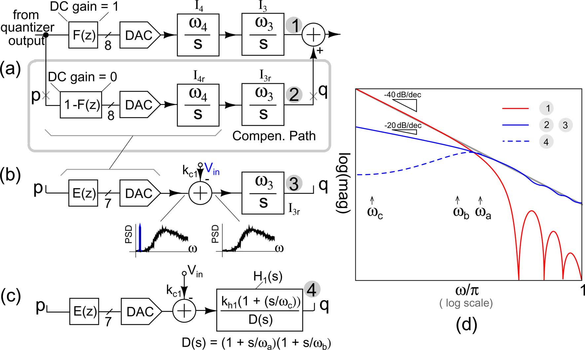
- **(a)** Signal path **(1)**: F(z)→DAC→I₄→I₃ has DC gain 1 but attenuates highs (falls as 1/ω², −40 dB/dec). A conceptual compensation path **(2)** = [1 − F(z)]→DAC→I₄ᵣ→I₃ᵣ (replicas, DC gain 0) makes up the high-frequency deficit.
- **(b)** Combine into **path (3)**: E(z) (a **7-tap** FIR, = the useful part of [1−F(z)]) → DAC → subtract k_c1·vin → I₃ᵣ. Subtracting vin leaves I₃ᵣ to integrate only **shaped noise** (no big signal → small cap). The compensation jitter is then amplified by only one integrator, not two.
- **(c)** Replace I₃ᵣ with a **bandpass filter H₁(s) = k_h1(1 + s/ω_c) / [(1 + s/ω_a)(1 + s/ω_b)]** — low DC gain (rejects offset) + 1/s roll-off at high f. This is **path (4)**.
- **(d)** Magnitude responses: path 1 (−40 dB/dec), paths 2/3 (−20 dB/dec), path 4 (bandpass, peaks near ω_c). Corner frequencies ω_c, ω_b, ω_a marked.

### 3.6 Final compensated architecture (Fig 7)
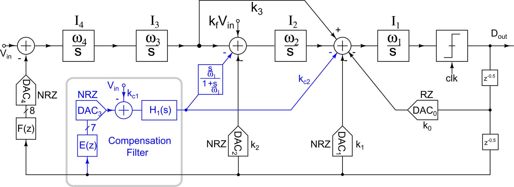
The complete loop:
- Main path: **vin − DAC₄** (DAC₄ = 8-tap **F(z)**, NRZ) → I₄ → I₃ → summing node.
- **Compensation filter** (blue box): DAC₃ (NRZ, 7-tap **E(z)**) − k_c1·vin → **H₁(s)** → fans out to (i) I₂'s input through a high-pass s/ω₁/(1+s/ω₁) with gain, and (ii) the summer before I₁ via **k_c2**. Feeding I₂/I₁ (not I₃) means the compensation path's non-idealities are attenuated by two integrators referred to input.
- Input feed-forward **k_f·vin** into the node after I₃; feed-forward **k₃** to the summer before I₁ (these give the STF peaking, small caps).
- **NRZ DAC₂ (k₂)** → I₂ input; **NRZ DAC₁ (k₁)** → I₁ input; **RZ DAC₀ (k₀)** → I₁ input for ELD.
- Quantizer with **z⁻⁰·⁵** half-delays in the feedback.
- Coefficients are set by **impulse invariance** accounting for **finite opamp bandwidths**.

### 3.7 Realised NTF and STF (Figs 8, 9)
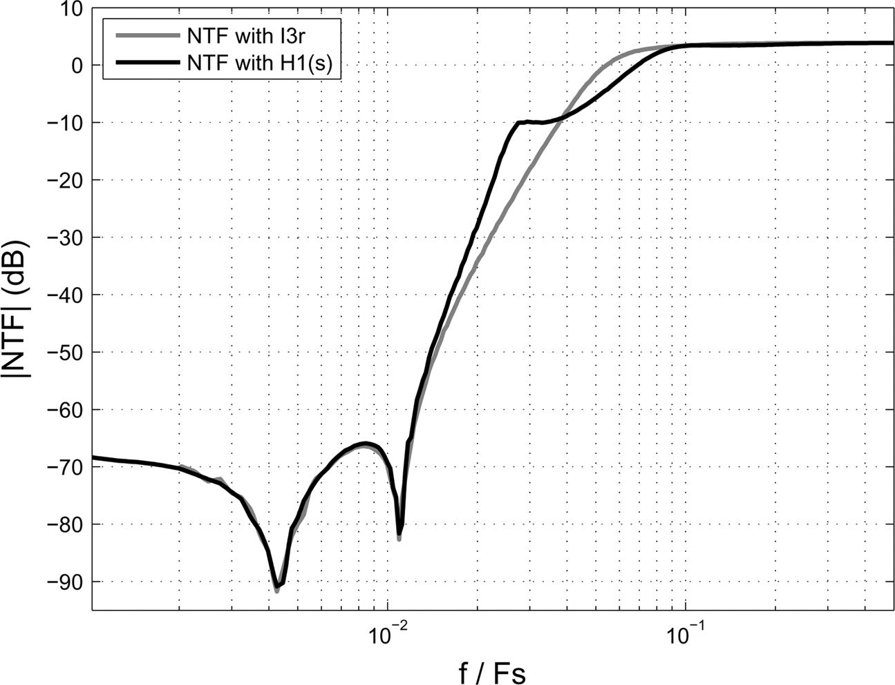
**Fig 8:** |NTF| vs f/Fs. The two optimised NTF zeros give the in-band notches (~ −90 dB). "NTF with H₁(s)" (the realised bandpass-compensated NTF) shows a kink near f/Fs ≈ 0.03 from H₁(s); it has the same in-band quantisation noise and MSA as the maximally-flat OBG-1.5 NTF, so the kink is harmless. *(Directly reproducible.)*

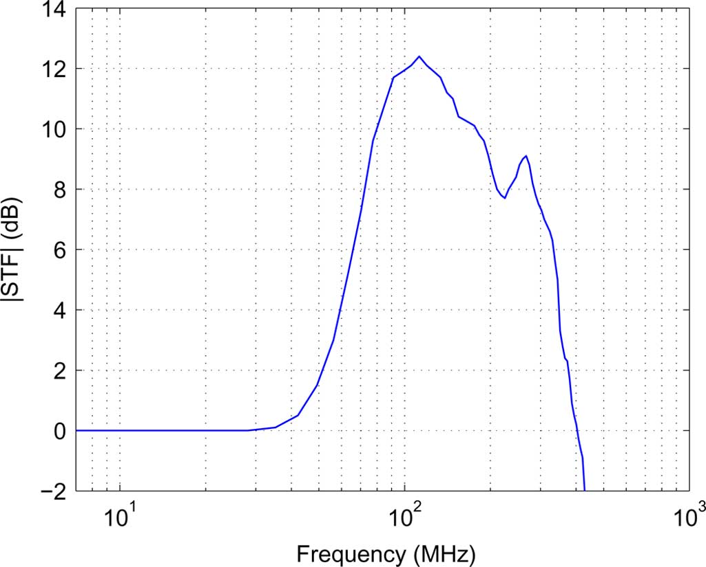
**Fig 9:** |STF| peaks to ≈ +12 dB around 100 MHz because of the extensive input feed-forward (small integrating caps). The peaking means **out-of-band blockers must be pre-filtered** before the modulator. *(Reproducible.)*

---

## 4. Circuit implementation (exam Q4 — describe blocks)

### 4.1 Loop filter (Fig 10) — the single-ended schematic
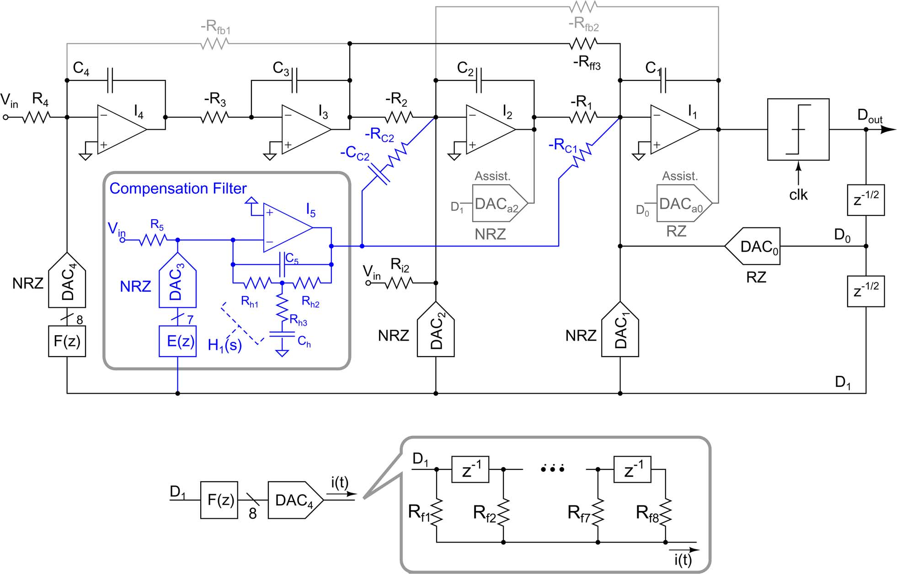
- Four **active-RC** integrators (I₄…I₁) with caps C₄…C₁ and input resistors R₄, −R₃, −R₂, −R₁; feedback resistors −R_fb1, −R_fb2, −R_ff3 implement the feed-forward/feedback coefficients (negative values = inversion in the fully-differential circuit).
- **Compensation filter** (blue): R₅, DAC₃ (NRZ, E(z) 7-tap), opamp I₅ with C₅ + R_h1, R_h2, R_h3, C_h realising **H₁(s)**; outputs couple via −R_c2/−C_c2 (to I₂) and −R_c1 (to I₁).
- **Assisted-opamp** current DACs: DAC_a2 (NRZ, assists I₂, from D₁) and DAC_a0 (RZ, assists I₁, from D₀) inject a replica of the integrator input current at the opamp output → less opamp burden for the fast input currents of I₁, I₂.
- Main feedback: D₁ → F(z) → DAC₄ → semi-digital FIR (R_f1…R_f8 with z⁻¹ taps) → I₄ virtual ground.
- z⁻¹ᐟ² half-delays on the quantizer output.
- Modulator **scaled so the first-order path saturates last**; reset switches across all caps as an anti-lockup safety feature; R and C realised as digitally trimmable banks (manual control) against time-constant variation.

### 4.2 Operational amplifiers (Fig 12)
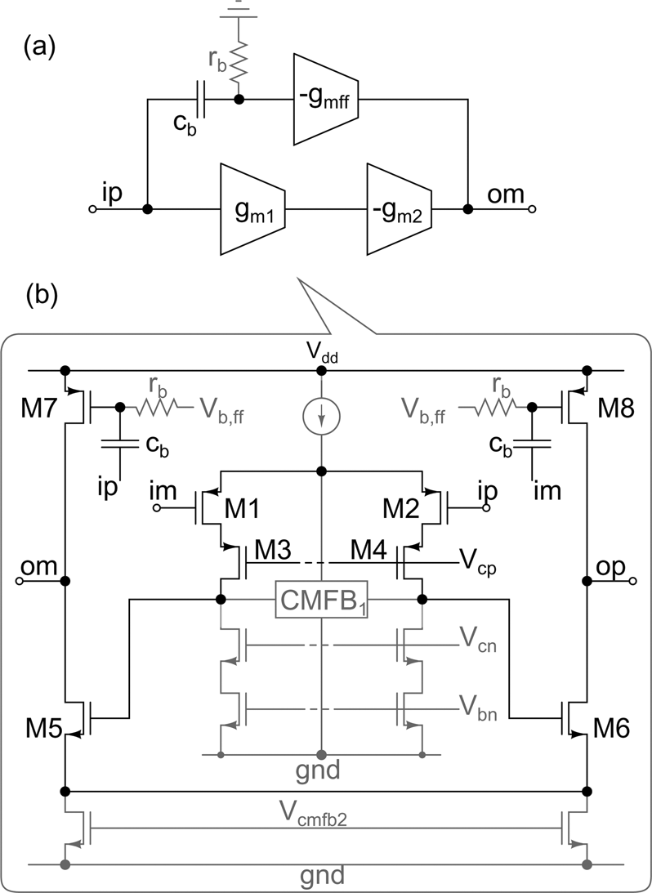
Two-stage **feed-forward-compensated** opamps (more power-efficient than Miller, no explicit compensation cap to charge). Long settling transient is acceptable in CT (the whole waveform is processed). AC-coupling the feed-forward path (caps C) increases output swing → smaller caps → higher integrator gain. **DC gain ≈ 55 dB, UGB ≈ 2 GHz.** Currents: I₄ = 3 mA; I₃, I₂, I₁ = 0.5 mA each; the I₅ opamp = 1 mA (fast, small feedback factor). *(These are the gain/BW numbers for the Q3.1 non-ideality.)*

### 4.3 Comparator (Figs 13–15)
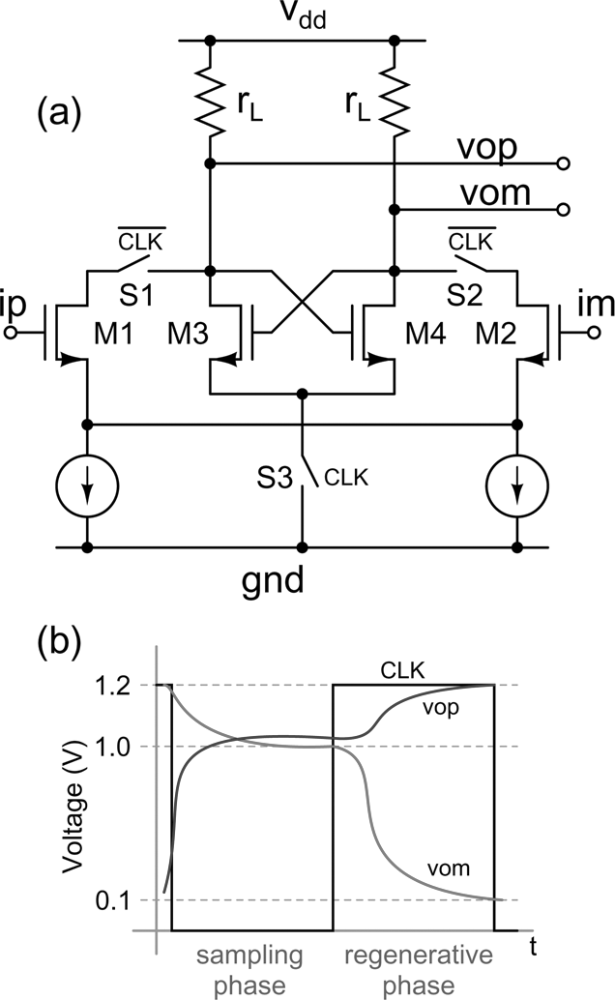
Single-phase-clocked comparator. Sampling phase (clk low): amplified input held on drain parasitics, output CM near supply. Regeneration phase: M3/M4 sources grounded → **very high initial current** → short regenerative time constant → low power for a given speed and good metastability behaviour. Output swings rail-to-rail → directly drives a CMOS latch (no CML level-shifters).
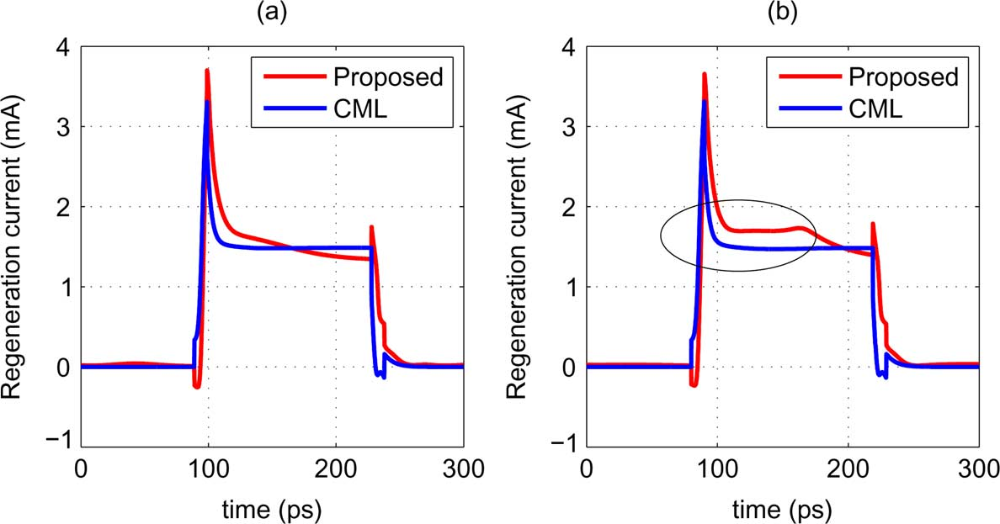
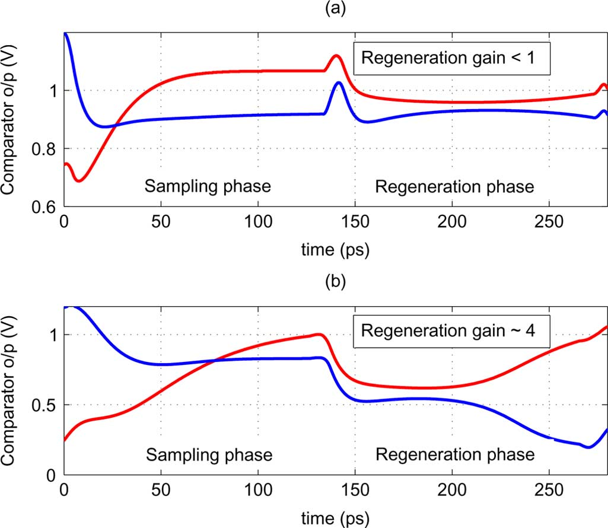
The proposed latch reaches a regenerative gain ≈ 4 at 3.6 GS/s vs < 1 for an equal-average-power CML latch.

### 4.4 Feedback DACs (Fig 16) + DAC nonlinearity/ISI (Fig 17)
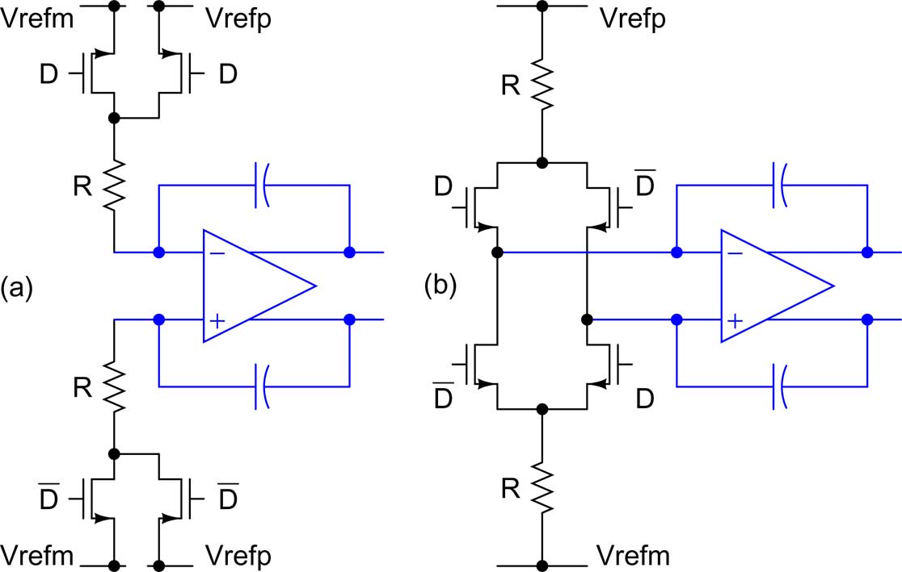
**Switched resistors** (low noise; current-steering avoided due to headroom noise + source-node distortion). Two options:
- **Reference-side switching:** loop gain doesn't change with time → preserves linearity; but distributed-RC delay for large R. Used where R < 10 kΩ / linearity critical (the main and compensation DACs).
- **Virtual-ground-side switching:** fast (no distributed-cap charging) but parasitic switching at the virtual ground degrades noise/linearity. Used where speed dominates.

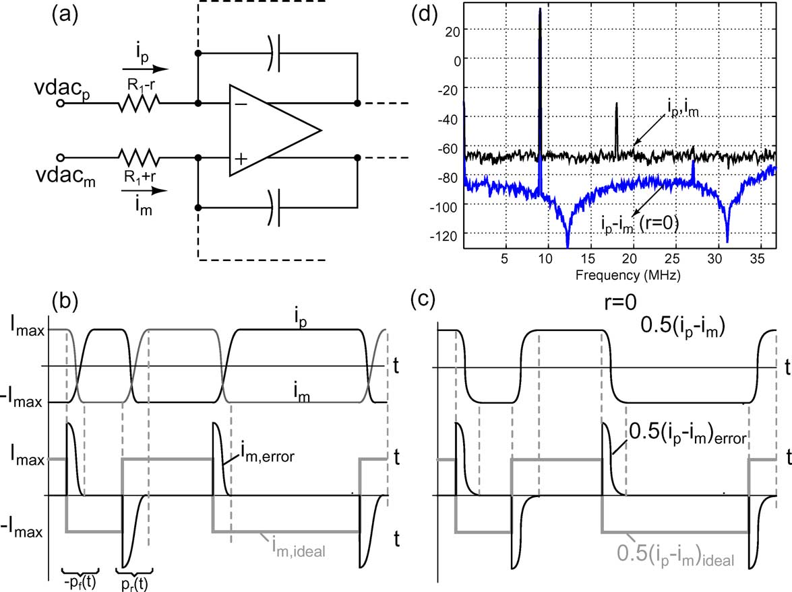
At GS/s the rise/fall times are a real fraction of the bit period and **unequal**. The single-ended DAC current = ideal ISI-free waveform + an error waveform ε(t). Because rise ≠ fall, ε at rising/falling edges are **not** inverted versions of each other → a nonlinear term ∝ (transition density) → **2nd-harmonic distortion + raised noise floor** (Eq. 2–3). The **differential** current cancels this if the two arms match (Fig 17c); residual mismatch leaves some HD2 (Fig 17d). Transition density falls as the input approaches full scale → distortion is amplitude-dependent (explains the SNDR kink in Fig 21). *(This is the mechanism behind the Q3 DAC non-ideality and the ISI-correction question.)*

### 4.5 Clock PLL (Fig 18)
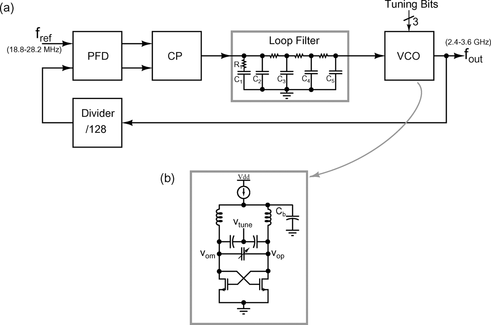
On-chip LC-PLL (low-frequency external reference): LC-VCO (cross-coupled NMOS, 2×2 nH inductors, MOS varactor + trimmable MIM bank, 2.4–3.6 GHz, ~200 MHz/V), ÷128, PFD, charge pump, loop filter (~100 kHz BW). Simulated VCO phase noise ≈ −120 dBc/Hz @ 1 MHz, < −160 dBc/Hz @ 100 MHz. PLL: 0.25 mm², 14.4 mW. *(Context for jitter; not usually modelled in MATLAB beyond an rms-jitter number.)*

---

## 5. Measurement results (exam Q2 — reproduce these)

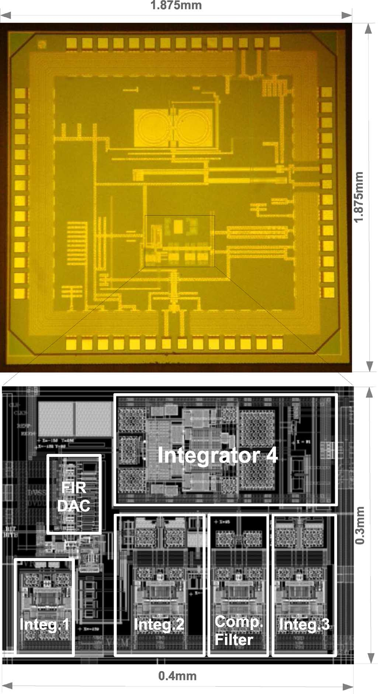
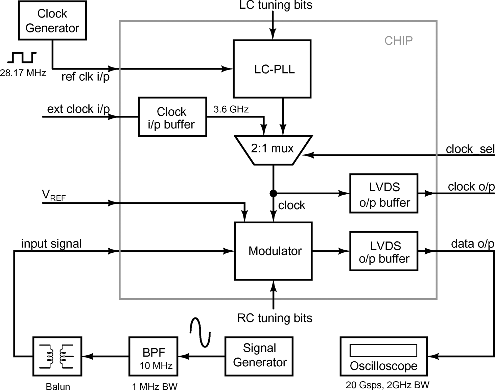
*Test setup:* on-chip LC-PLL or external clock via 2:1 mux; BPF (Allen Avionics) cleans the input tone; balun → differential; full-rate LVDS output captured on a real-time scope (Agilent DSO80204B) and post-processed; **32-K Blackman–Harris window** for spectra. (Note: the *course* style uses Kaiser(N,20); see `04_matlab_requirements.md`.)

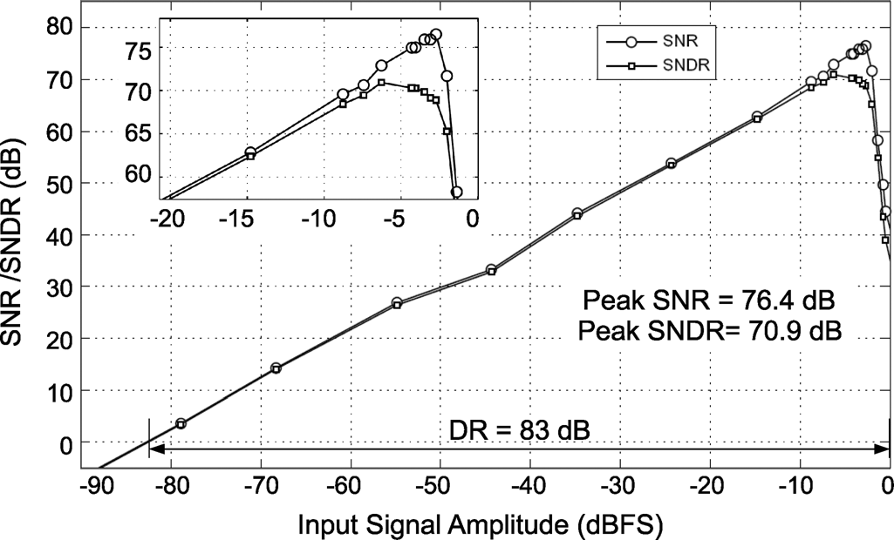
**Fig 21:** Peak SNR 76.4 dB, peak SNDR 70.9 dB, **DR 83 dB** in 36 MHz. Note the **kink near −55 dBFS** (onset of the ISI noise rise) and the HD2 roll-off near −8 dBFS — both ISI symptoms. *(Reproduce the full SNR/SNDR-vs-amplitude sweep.)*

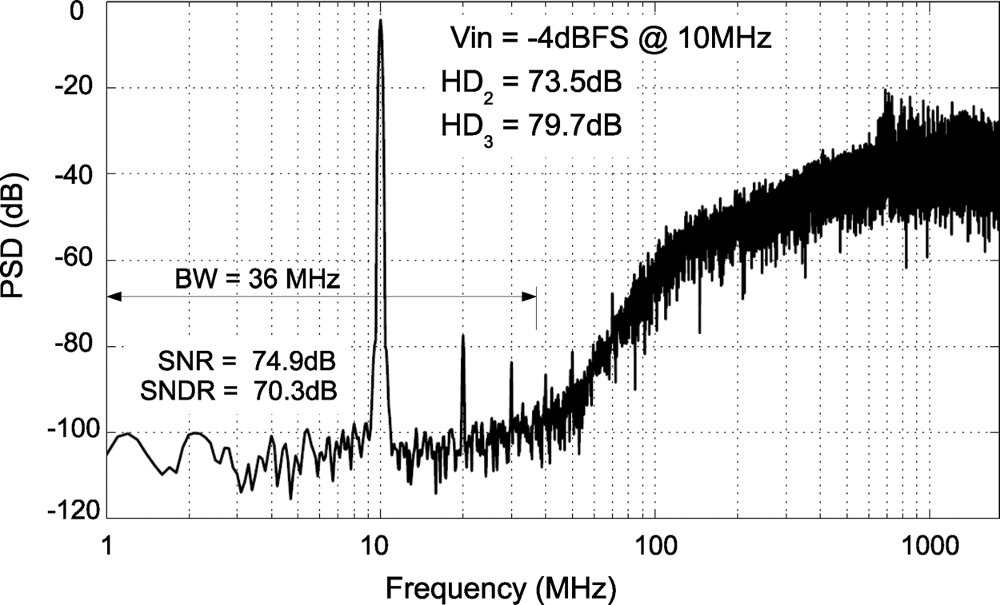
**Fig 22:** PSD over 1 MHz–2 GHz. HD₂ = 73.5 dB, HD₃ = 79.7 dB, BW = 36 MHz, SNR = 74.9 dB, SNDR = 70.3 dB. SNDR is **limited by HD2** (ISI). *(The canonical spectrum to reproduce; show before/after decimation.)*

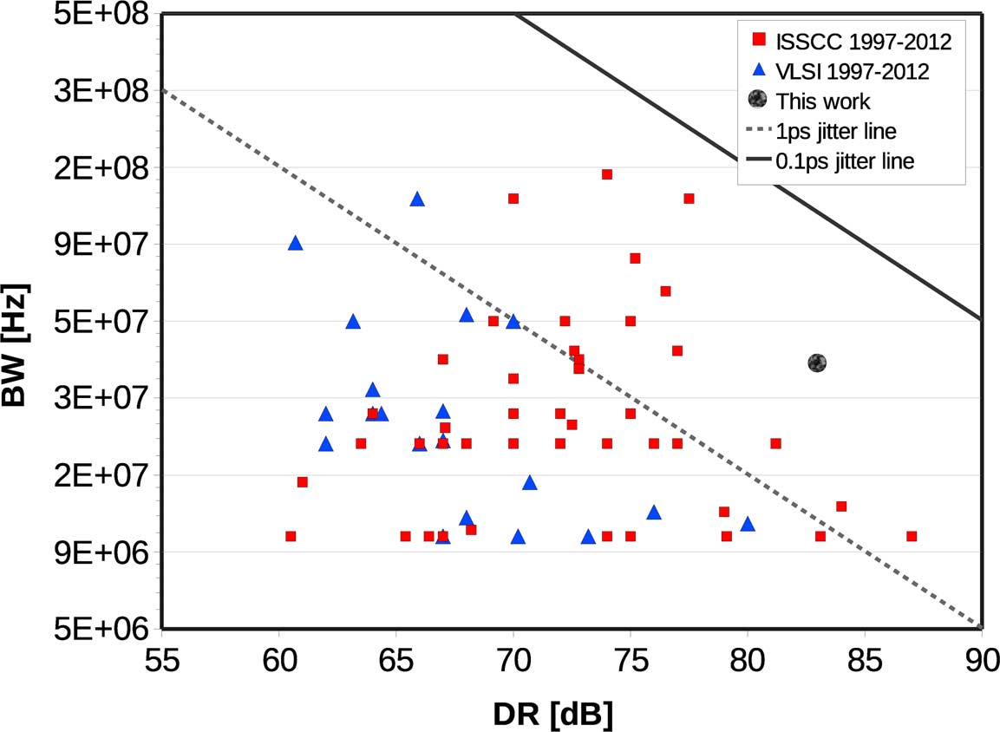
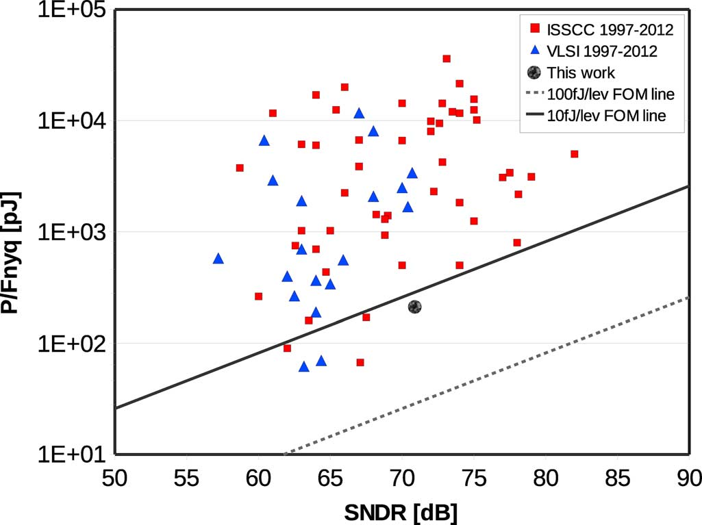
Among ADCs with DR > 80 dB this design has the highest BW; among SNDR > 70 dB it has the best FoM (these are survey scatter plots, not MATLAB-reproducible).

### 5.1 Jitter measurements (Figs 25–27)
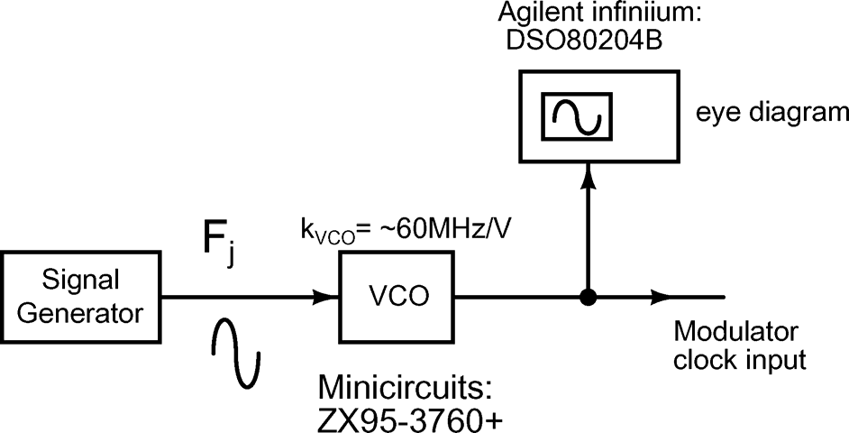
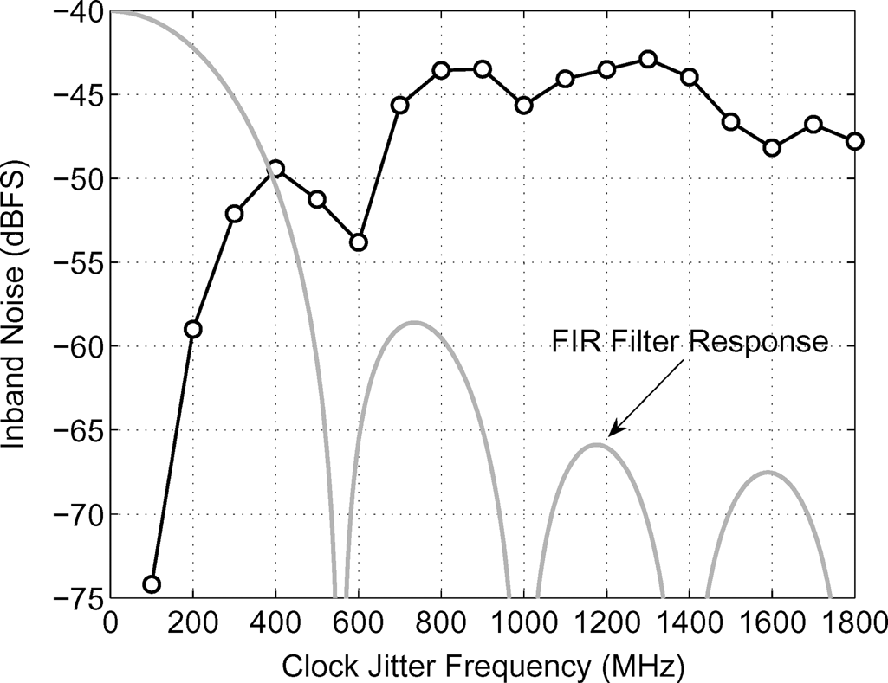
**Fig 26:** rms jitter fixed at 10 % of Ts; modulating frequency swept 100 MHz→1.8 GHz. The measured in-band noise shows **minima near 600 and 800 MHz**, coinciding with the **zeros of F(z)** — direct proof of the FIR DAC's "jitter-filtering" action (gray = FIR magnitude response). *(Reproducible: sweep a sinusoidal-FM jitter and overlay |F(z)|.)*
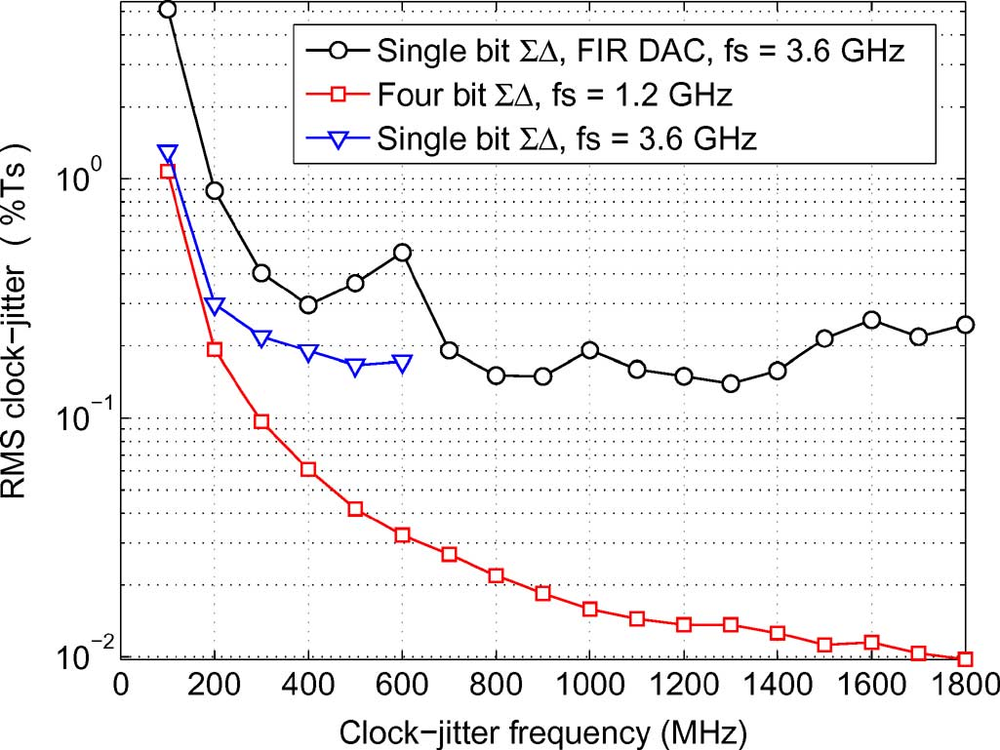
**Fig 27:** Max tolerable rms jitter (for −80 dBFS idle-channel noise). The 1-bit+FIR design tolerates jitter **comparable to a 4-bit modulator at fs/3** and **~10× more** than a single-bit design without the FIR DAC. *(Reproducible.)*

### 5.2 Performance summary & comparison (Tables I, II)
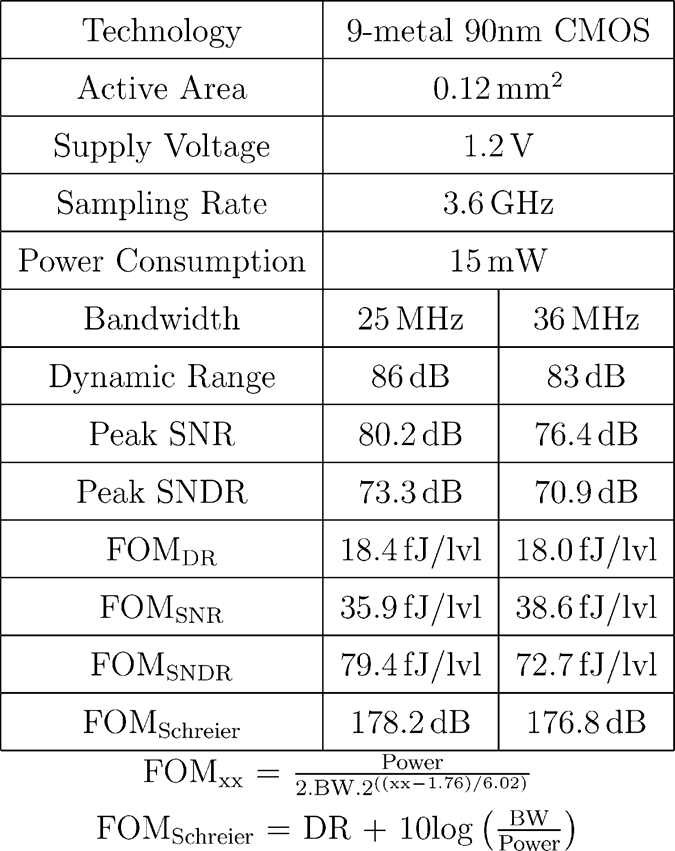
![Table II — comparison with state-of-the-art [1]-[6]](figures/tableII_performance_comparison.png)
**Table II columns:** This Work, [1] Mitteregger '06, [2] Kauffman '11, [3] Dhanasekaran '09, [4] Malla '08, [5] Park–Perrott '09, [6] Bolatkale '11. **This is the table to EXTEND** for exam Q6 (add post-2012 designs — see `06_literature_review.md` / `07_references_ieee.md`).
FoM definitions used: FoM_xx = Power / (2·BW·2^((xx−1.76)/6.02)); FoM_Schreier = DR + 10·log₁₀(BW/Power).

### 5.3 ISI correction (Figs 28–30) — a proposed-improvement candidate
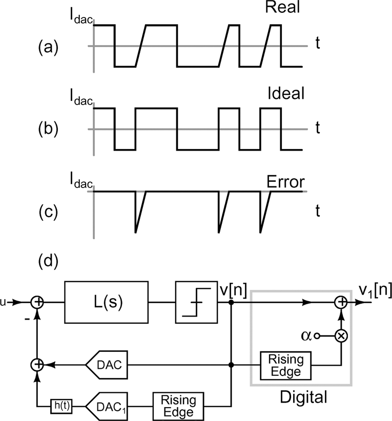
**Fig 28:** Model the NRZ DAC as ideal + a parallel nonlinear path injecting a small pulse α at **every rising edge** (d). Correct by adding a digital sequence α at each rising edge of the raw bitstream (chosen to null HD2). Done in software here to confirm the mechanism.
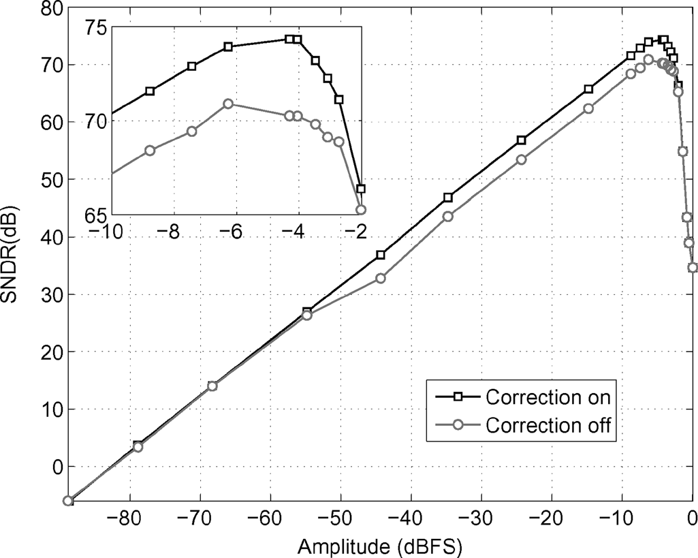
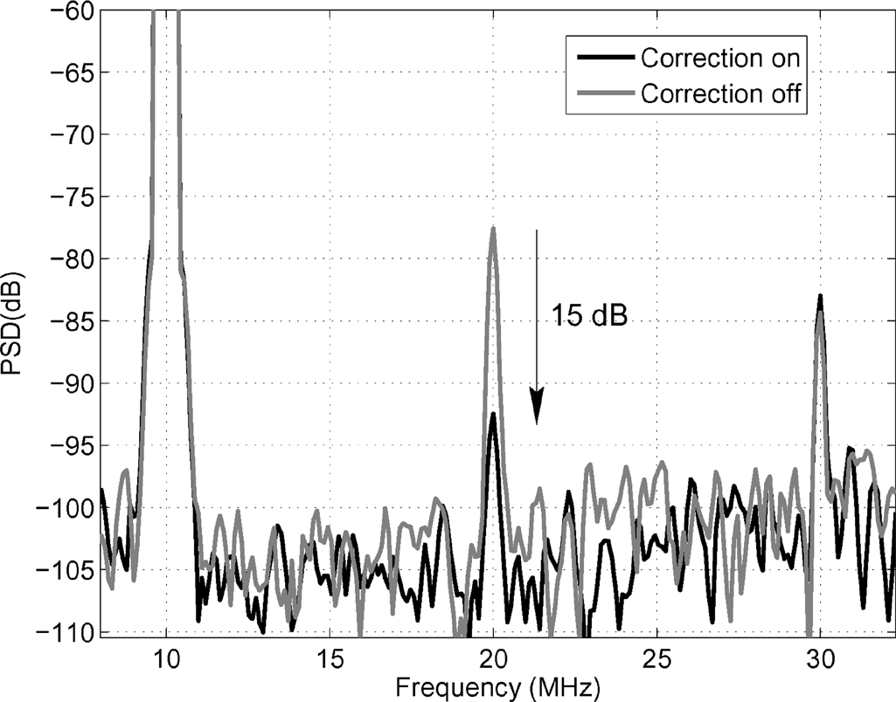
**Result:** correction removes the kink, peak SNDR → **74.3 dB**, peak SNR → 77.5 dB, HD2 down ~15 dB, lower floor. Confirms ISI origin and shows the design could be more power-efficient. *(Strong basis for the Q7 "propose improvements + verify in MATLAB" answer.)*

---

## 6. The FIR coefficients (build the model from these)

**Main feedback FIR, Eq. (1)** — 8-tap, linear-phase (symmetric), DC gain 1:

```
F(z) = 0.07(1 + z^-7) + 0.12(z^-1 + z^-6) + 0.15(z^-2 + z^-5) + 0.16(z^-3 + z^-4)
```

Tap vector: **f = [0.07, 0.12, 0.15, 0.16, 0.16, 0.15, 0.12, 0.07]** (Σf = 1.0). Optimised assuming the clock jitter spectrum falls as 1/f² (not equal taps). Zeros of F(z) on the unit circle produce the Fig-26 jitter-noise minima.

**Compensation FIR E(z):** a **7-tap** filter, **E(z) = (1 − F(z)) / (1 − z⁻¹) = M₁(z)** (one integrator folded out; DC gain 0). The explicit 7 numeric taps are **not printed in the journal** — derive them (method in `09_reference_notes.md` §B.2/B.3; Shettigar's thesis is not public).

**Compensation bandpass H₁(s) = k_h1(1 + s/ω_c) / [(1 + s/ω_a)(1 + s/ω_b)]** — pole/zero values not printed; set by impulse-invariance matching of path (3) over the band (see Fig 6/11). ω_c, ω_a, ω_b are visible qualitatively in Figs 6(d)/11 (peak ≈ 100 MHz).

**Integrator unity-gain frequencies ω₁…ω₄** and the feedback/feed-forward coefficients k₀,k₁,k₂,k₃,k_f,k_c1,k_c2 are **not tabulated**; obtain them by synthesising the 4th-order OBG-1.5 NTF with two optimised zeros and CIFB→CT mapping (impulse invariance), then scaling integrator swings (see `04_matlab_requirements.md`).

---

## 7. One-paragraph thesis (for the title/intro slide)

> A single-bit quantizer is the cheapest, most linear way to close a CT ΔΣ loop, but its full-scale NRZ feedback makes it ruinously sensitive to clock jitter and comparator metastability and demands a very linear loop filter. Shettigar & Pavan break that trade-off by filtering the 1-bit bitstream through an **8-tap semi-digital FIR DAC**, so the feedback waveform becomes the small-step, multi-level signal of a multi-bit modulator — inheriting its jitter tolerance and relaxed linearity — while the DAC stays inherently 2-level-linear (no DEM). The cost is the FIR's group delay, which they cancel with a mostly-analog, bandpass-shaped **compensation path** that restores the target 4th-order OBG-1.5 NTF without re-injecting the compensation path's own jitter/offset in-band. The 3.6 GS/s, 90 nm prototype reaches 71 dB SNDR / 83 dB DR over 36 MHz at 15 mW — a 72.7 fJ/lvl FoM — making single-bit competitive in a regime previously owned by multi-bit designs.
